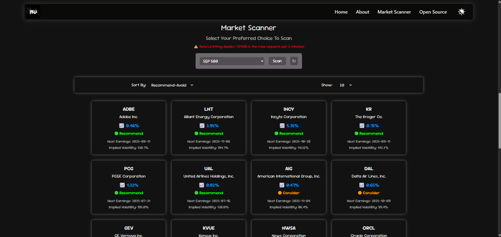
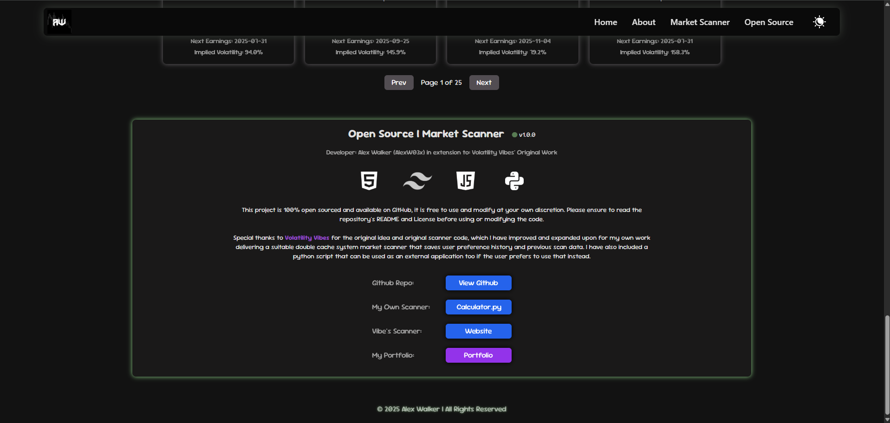
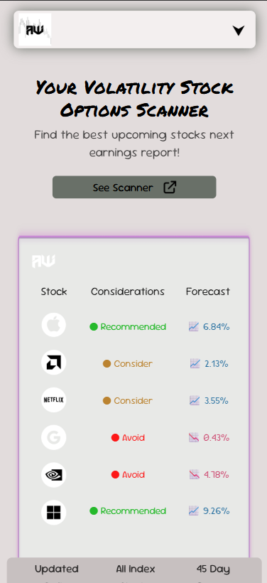

AW Stock Options Scanner ✨

Project Description
The AW Stock Options Scanner is a Flask web application designed to analyze and recommend stock options based on implied volatility (IV). The project was inspired by the original market scanner from Volatility Vibes, with the goal of improving upon its foundation by fixing deprecated code, enhancing efficiency, and providing a more user-friendly web interface.

This application scans entire market indices (like the S&P 500, NASDAQ 100, and Dow Jones) using an improved, multi-threaded Python backend. It evaluates stocks based on IV vs. historical volatility (HV), average trading volume, and term structure slope to generate "Recommend," "Consider," or "Avoid" ratings for options trading around earnings events.

This project also served as a personal development exercise to deepen my skills in Python, Flask, API integration, and front-end technologies before the start of university.

Python Installation & Requirements
To run this project locally, you'll need Python installed. First, install the required packages using the requirements.txt file.

The following libraries are required:

Flask
pandas
yfinance
numpy
gunicorn
scipy

You can install them all at once by running the following command in your terminal:

pip install -r requirements.txt

Setting Up a Local Instance
Create a Virtual Environment: It's highly recommended to use a virtual environment to manage project dependencies.

# Create the environment
python -m venv venv

# Activate it (Windows)
.\venv\Scripts\activate

# Activate it (macOS/Linux)
source venv/bin/activate

Install Requirements: Once your virtual environment is active, install the packages as shown above.

Run the App: Start the Flask development server.

python app.py

The application will then be running on your local machine, typically at http://127.0.0.1:5000.

Deployment
This web application can be deployed to any web host that supports Python and Flask applications. For a quick and easy setup, I recommend using a service like Render, which offers a free tier that is perfect for this type of project.

📸 Project Showcase
Home Page

About Section

Market Scanner

Open Source Section

Mobile View (Light Mode)

Credits
A special thanks to Volatility Vibes for the original concept and foundational code that inspired this project.

Volatility Vibes Website

My Learning Journey & Challenges
This project was a fantastic learning experience. Here are some of the key takeaways and hurdles I encountered.

What I Learned
Efficient Data Processing: I learned how to refactor an existing tool into a more object-oriented and reusable structure. Implementing asynchronous, multi-threaded code was crucial for efficiently fetching data for hundreds of stocks at once without long wait times.

Flask Web Development: This was my first major project building a web app with Python and Flask. I gained a much better understanding of routing, folder structure, and passing data from the backend to the Jinja2 templates on the front end.

CI/CD and Deployment: Using a new service like Render gave me hands-on experience with Continuous Integration/Continuous Deployment (CI/CD) pipelines, making the deployment process smooth and automated.

Struggles & Solutions
API Rate Limiting: The Yahoo Finance API would often block requests from the Render server's shared IP address. I built a workaround by implementing a retry mechanism with delays, which made the data fetching process far more resilient and reliable.

Cache Implementation: To avoid re-scanning the entire market on every page load, I implemented a server-side caching system. This system stores the results of a full scan and serves them to users until the cache expires (daily), drastically improving performance and reducing API calls.

Double Cache System: I created a two-layer cache: a primary server-side cache in Python and a secondary browser-based localStorage cache. This ensures the application remains fast for the end-user and provides a fallback if the server cache is being refreshed.

Data Pagination: Displaying over 500 stock results on a single page was not feasible. With some help from AI, I implemented a dynamic pagination system in JavaScript that allows users to easily browse through the large dataset without overwhelming the browser.